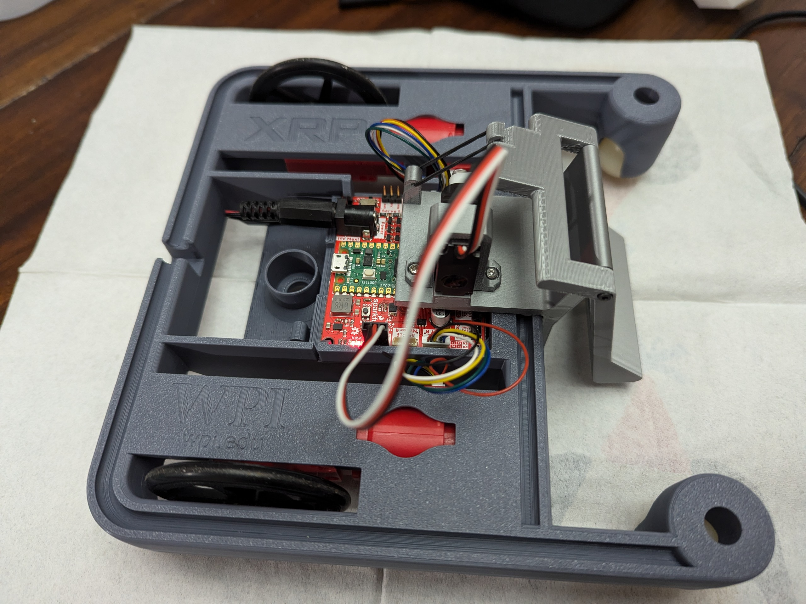
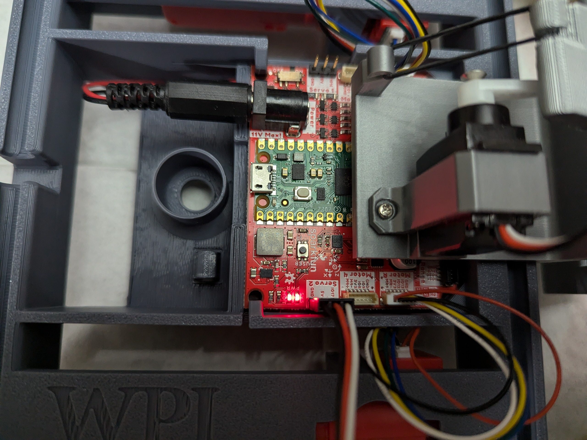
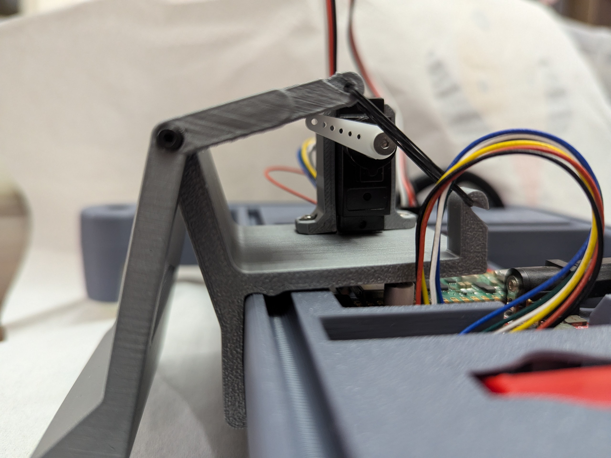

# Kicker Example

This example uses the 3D-printed part found at [printables.com](https://www.printables.com/model/790117-xrp-soccer-robot).

This is a sample robot program for a XRP robot with a [Soccer Ball Kicker Attachment](https://www.printables.com/model/790117-xrp-soccer-robot). The Soccer Ball Kicker Attachment uses a single servo to control its position. For this example, we will assume you are connecting to the XRP in AP mode. Modify the [build.gradle](build.gradle) file, HALSIMXRP_HOST variable if you have a different IP address. Additionally, it will be assumed you are using a [Logitech F310 Gamepad](https://www.logitechg.com/en-us/products/gamepads/f310-gamepad.940-000110.html). If you are using a different joystick, you will want to modify [Constants.java](src/main/java/frc/robot/Constants.java) and [RobotContainer.java](src/main/java/frc/robot/RobotContainer.java) to your liking.

## Hardware configuration
The Kicker is connected to the frame as shown here:

Note that for this exmaple, we connect the Kicker Servo to Servo Port 2 as seen here:

## How It Works
This mechinism is designed to leverage the kicker as a lever. It is loaded with a small rubber band and held in position by the horn of the servo. By moving the servo up (expanding the rubber band), it brings the kicker closer to the robot like bringing your leg back to kick a ball. See image below:

if you rotate the arm further, the horn will slide off the kicker, the rubber band will snap back to resting length and the kicker will pivot around the middle such that the bottom springs out. This works much like a mouse trap. If you look at the subsystem [kicker.java](src/main/java/frc/robot/subsystems/Kicker.java), this is where the code is written to control the kicking mechanism. Note, depending on your mounting configuration and the position of your horn when disabled (servo position 0), you may need to adjust RESET_ANGLE and KICK_ANGLE in the Kicker Subsystem to achieve the kicking motion.