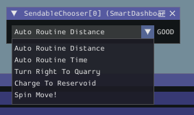

# How to Autonomous (with the XRP Example)

## What even is autonomous mode?

In FRC competitions, there is a 15-30 second period at the start of the game where your robot has to drive by itself 😱 This is known as the _autonomous_ period. You write code to allow the robot to control itself for this amount of time.

## Autonomous code in the XRP Reference project

The XRP Reference example project in WPILib includes some _commands_ that you can use as building blocks to make your own autonomous routines. We'll go through some of them here.


### Individual Commands (Building Blocks)

There are 4 "building block" commands that are provided with the XRP Reference project. These do very basic actions, but you can string them together to make more complex commands.

#### DriveDistance

This command will make your XRP drive (in an approximately straight line) for a set distance (in inches), at a certain speed (-1.0 to 1.0, where -1.0 is full speed backwards, and 1.0 is full speed forwards). Once this is complete, the robot will stop.

This command makes use of the Encoders on the XRP to keep track of how far the robot has moved.

#### DriveTime

This command will make your XRP drive (in an approximately straight line) for a set time (in seconds), at a certain speed (-1.0 to 1.0, where -1.0 is full speed backwards, and 1.0 is full speed forwards). Once this is complete, the robot will stop.

#### TurnDegrees

This command will make your XRP turn in place by a desired angle (in degrees), at a certain speed (-1.0 to 1.0, where -1.0 is full rotation speed counter-clockwise, and 1.0 is full rotation speed clockwise). Once this is complete, the robot will stop.

This command makes use of the Encoders on the XRP, and some math, to convert between distance driven and how much the robot has turned. Take a look at the `isFinished()` method in the TurnDegrees.java file to see the math.

#### TurnTime

This command will make your XRP turn in place for a set time (in seconds), at a certain speed (-1.0 to 1.0, where -1.0 is full rotation speed counter-clockwise, and 1.0 is full rotation speed clockwise). Once this is complete, the robot will stop.

### Chained Commands

The building block commands by themselves are not the most useful (unless you just want the robot to drive straight for a bit). In most cases, it's a bit more useful to chain a series of commands together. For example, if you want the XRP to draw an approximate U-shape (or, I don't know... have your robot climb up a certain ramp in the middle of a certain field...), you can think about the autonomous routine as:

1. Drive for 24 inches
2. Turn 90 degrees to the right
3. Drive for 12 inches
4. Turn 90 degrees to the right
5. Drive for 24 inches

In terms of the building block commands, this could be expressed as:

1. `DriveDistance(0.5, 24, drivetrain)` <-- Half speed, 24 inches forward
2. `TurnDegrees(0.5, 90, drivetrain)` <-- Half rotational speed, 90 degrees clockwise
3. `DriveDistance(0.5, 12, drivetrain)` <-- You get the idea...
4. `TurnDegrees(0.5, 90, drivetrain)`
5. `DriveDistance(0.5, 24, drivetrain)`

The `AutonomousDistance` and `AutonomousTime` command examples show how these different building block commands can be string together. In both of those examples, they use a `SequentialCommandGroup`, which, as the name implies, runs a group of commands, one after the other.

These are pretty easy to set up as you can see in the example (reproduced here):

```java
public AutonomousDistance(Drivetrain drivetrain) {
    addCommands(
        new DriveDistance(-0.5, 10, drivetrain),
        new TurnDegrees(-0.5, 180, drivetrain),
        new DriveDistance(-0.5, 10, drivetrain),
        new TurnDegrees(0.5, 180, drivetrain));
  }
```

Basically, in the constructor, use the `addCommands` method to add new commands! So, if we wanted to change the `AutonomousDistance` chained command to do that U-shaped path we described above, we can do something like:

```java
public AutonomousDistance(Drivetrain drivetrain) {
    addCommands(
        new DriveDistance(0.5, 24, drivetrain),
        new TurnDegrees(0.5, 90, drivetrain),
        new DriveDistance(0.5, 12, drivetrain),
        new TurnDegrees(0.5, 90, drivetrain),
        new DriveDistance(0.5, 24, drivetrain)
  }
```

#### Creating your own chained command

It's helpful to create your own chained commands (e.g. maybe you want one path to drop off some snowballs in the reservoir, and another path to drop off rocks in the quarry). To do this, with your project open in VSCode, right click on the `commands` folder and select `Create a new  class/command`.


When prompted, select `SequentialCommandGroup`


After that, name your command (use CamelCase and don't have any spaces!)


Hit Enter after this and you should have a new command!  You can then start building out your very own complex command by adding appropriate building blocks (or even other complex commands!) to the `addCommands` method.


## Selecting between autonomous commands

Won't be much fun if you've built all these commands and have no way to select them, would it?

Once you've assembled your collection of commands/command groups, here's how you can make use of them!

You should have a line similar to the one below in `RobotContainer.java`:


This sets up a `SendableChooser`, which, like the name implies, allows you to choo-choo-choose an autonomous command to be run during the autonomous phase.

In the `configureButtonBindings` method, we can see where commands are added to the chooser (highlighted code in the image below):


The `setDefaultOption()` and `addOption()` methods both take in a name to use to identify the command on a dashboard, as well as a command or command-group to use when that item is selected. Using `setDefaultOption()` will guarantee that there will always be a selected item.

You can add as many commands as you want to the chooser! For example:

```java
m_chooser.setDefaultOption("Auto Routine Distance", new AutonomousDistance(m_drivetrain));
m_chooser.addOption("Auto Routine Time", new AutonomousTime(m_drivetrain));
m_chooser.addOption("Turn Right To Quarry", new TurnRightToQuarry(m_drivetrain));
m_chooser.addOption("Charge To Reservoid", new ChargeToReservoir(m_drivetrain));
m_chooser.addOption("Spin Move!", new TurnTime(0.5, 10, m_drivetrain));
```

This will add 5 total commands to the chooser, with the default option being an `AutonomousDistance` command. Go ahead and add/replace your own commands to the chooser!

### Uh, where do these show up?

So, this line:

```java
SmartDashboard.putData(m_chooser);
```

will cause the appropriate data to be sent to the Simulator dashboard, allowing it to show a dropdown with the options you have.

To see this in the simulator UI, do the following:

- Click on the Network Tables menu item
- Hover over SmartDashboard
- Select SendableChooser[0]


This will put a chooser widget on the simulator UI screen. You can use this widget to select the autonomous routine that you want!



### Testing your autonomous command

Once you have the chooser populated appropriately, select the routine you want to use, and then in the "Robot State" selector, select "Autonomous". If you're connected to your XRP, you should see your autonomous routine start to run!

## What else can I automate/command?

You can create your own building block commands as well! For example, the [Kicker example](https://github.com/bb-frc-workshops/xrp-examples/tree/main/KickerExample) has several new building block commands for kicking, arming, resetting the kicker etc. Take a look at the source repo for ideas: https://github.com/bb-frc-workshops/xrp-examples/tree/main/KickerExample/src/main/java/frc/robot/commands

If you are using a servo to control an arm for example, you can have the Arm subsystem built (similar to this [Chomper example](https://github.com/bb-frc-workshops/xrp-examples/blob/main/xrp-chomper/src/main/java/frc/robot/subsystems/Chomper.java)) with methods that set servo positions. (The chomper example is a bit more complex in that it uses "named" positions. The [Kicker Subsystem example](https://github.com/bb-frc-workshops/xrp-examples/blob/main/KickerExample/src/main/java/frc/robot/subsystems/Kicker.java#L32-L35) is a bit more straightforward, exposing a flexible `setAngle()` method, as well as more specific `reset()` and `kick()` methods that call `setAngle()` with specific values).